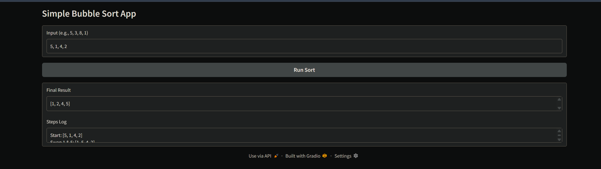
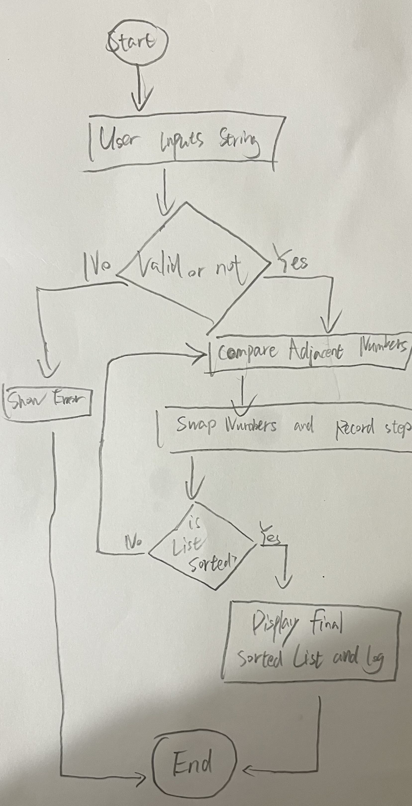

# Bubble Sort Visualizer

A Python app to visualize the Bubble Sort algorithm using a simple GUI.

## Project Links
- **Hugging Face App:** [https://huggingface.co/spaces/YuchengChen/Sorting-Project/tree/main]
- **GitHub Repository:** [https://github.com/elxzyzz/Sorting_Project]

## Demo

## Computational Thinking
I applied the four pillars of computational thinking to plan this project:

1. **Decomposition:** I broke the project into: Input (getting numbers), Logic (sorting loop), and Output (showing steps).
2. **Pattern Recognition:** The algorithm uses a repeating pattern: compare two neighbors, and swap them if the left is bigger (`if left > right: swap`).
3. **Abstraction:** I hid the complex loop counters (`i`, `j`) from the user and only displayed the list changes (e.g., `Swap: [1, 3]`).
4. **Algorithm Design:** Flow: `User Input` -> `Check Errors` -> `Sort & Log Steps` -> `Update Screen`.

### Algorithm Flowchart

## How to Run
1. Install requirements: `pip install -r requirements.txt`
2. Run the app: `python app.py`

## Testing Evidence
I verified the app with these test cases:
* **Standard Case:** Input `5, 1, 3` -> Result `[1, 3, 5]` (Correct).
* **Sorted Case:** Input `1, 2, 3` -> Result `[1, 2, 3]` (No swaps).
* **Error Case:** Input `a, b, c` -> Result `Error Message` (Handled safely).

## Author
- **Course:** CISC-121

- **Project:** Search/Sort Algorithm Visualization

